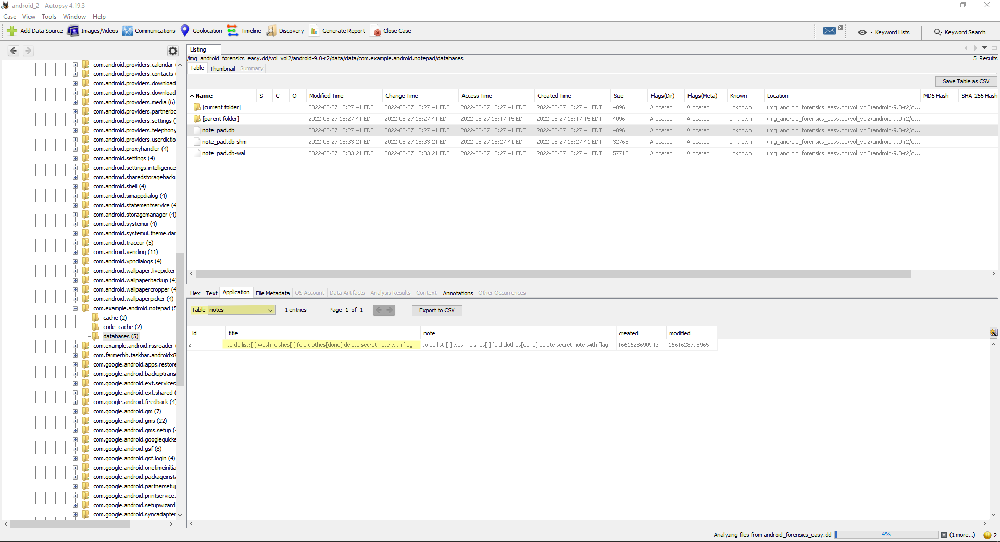
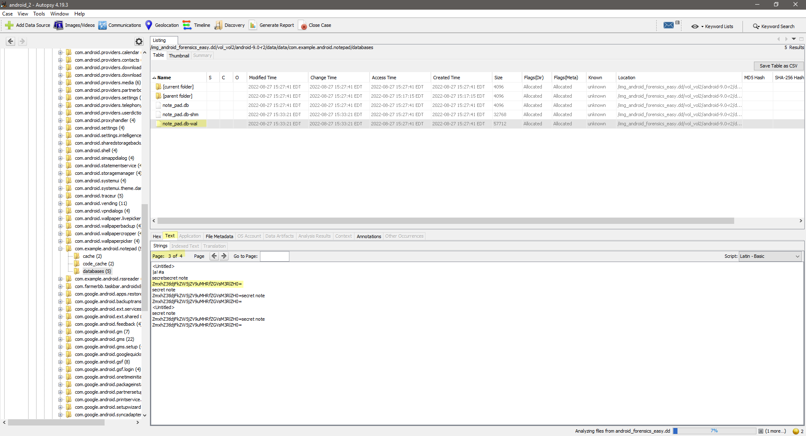
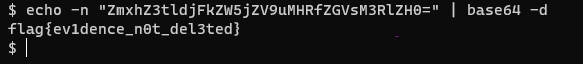
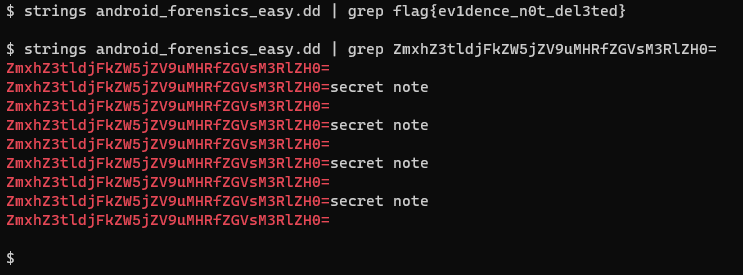

# Solution

A dd dump of androidx86 vm. Can be opened in FTK Imager or Autopsy.  

The note_pad db has a clue.  

The .db-wal file has a base64 string in it.  

Decode this string to get the flag.  

strings  

